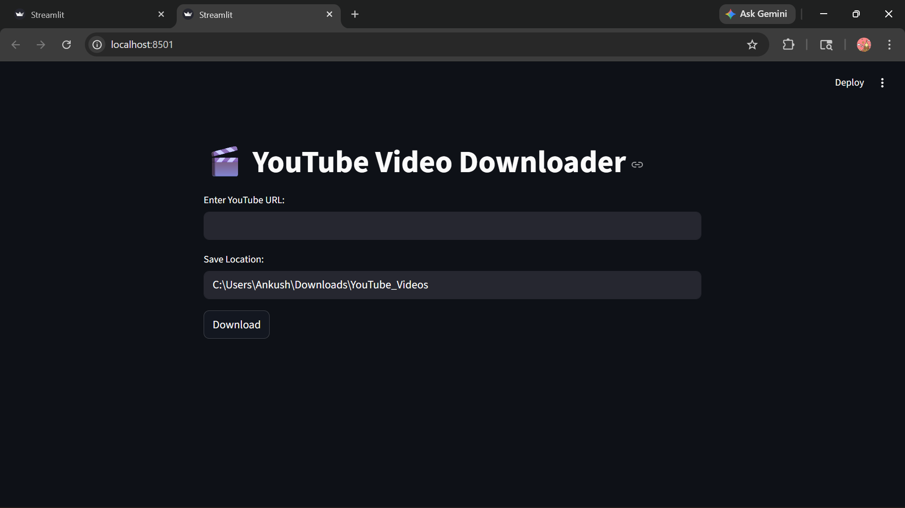
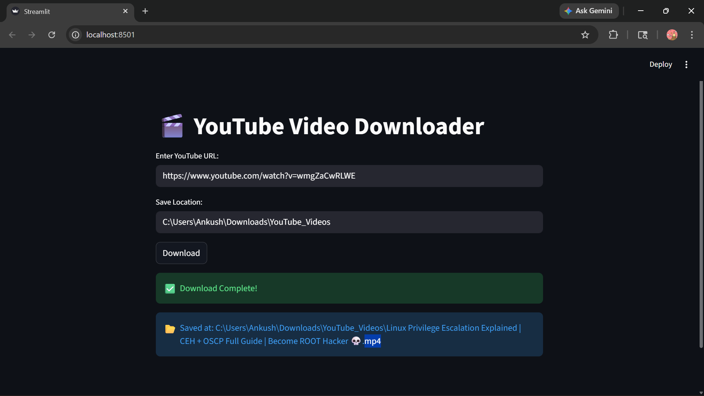

# 🎬 YouTube Video Downloader

A simple and clean web-based YouTube Video Downloader built with **Python** and **Streamlit**. Download any YouTube video in the highest available quality directly to your local storage.

---

## 🖥️ Preview




---

## ✨ Features

- 🔗 Download any YouTube video by just pasting the URL
- 📥 Downloads in **best available quality** (video + audio merged)
- 📂 Choose **custom save location** or use default Downloads folder
- ✅ Shows **exact path** where video is saved after download
- ⚡ Simple and clean **web-based UI** using Streamlit

---

## 🛠️ Tech Stack

| Tool | Purpose |
|------|---------|
| Python | Core language |
| yt-dlp | YouTube video extraction & download |
| Streamlit | Web-based GUI |

---

## 📦 Installation

**1. Clone the repository**
```bash
git clone https://github.com/Anku9305/Youtube_Video_Downloader.git
cd Youtube_Video_Downloader
```

**2. Install dependencies**
```bash
pip install yt-dlp streamlit
```

---

## ▶️ Usage

```bash
streamlit run youtube_video_downloader.py
```

- Enter the YouTube video URL
- Choose save location (or use default)
- Click **Download** and wait for completion
- Path of saved video will be displayed ✅

---

## 📌 Requirements

- Python 3.7+
- Internet connection
- ffmpeg (for merging video & audio) → [Download here](https://ffmpeg.org/download.html)
